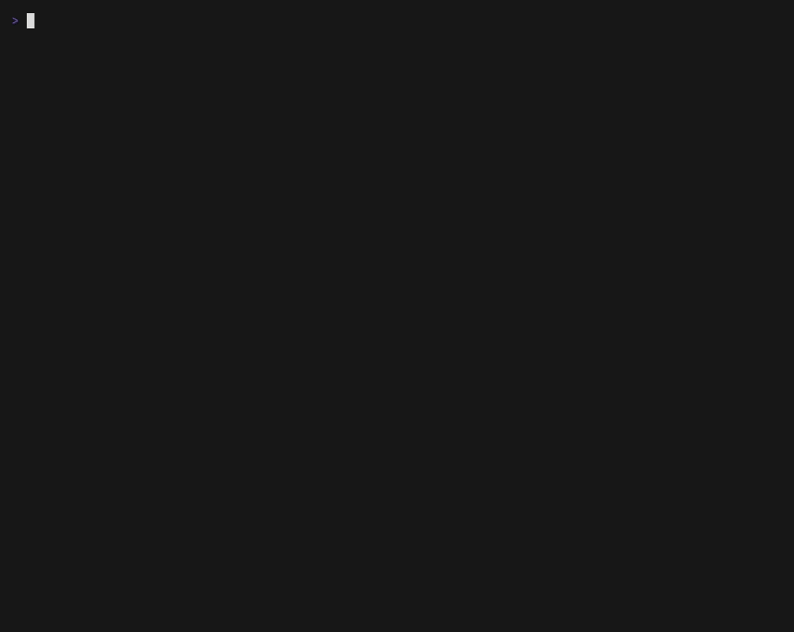

<div align="center">

# ⚡ Torlyx

### Scan your vibe-coded app before you ship it.

Built an app with Cursor, Claude Code, Bolt, Lovable or v0? It probably works.
It's probably also leaking API keys, missing auth on half its endpoints, and
wide open to SQL injection. **Torlyx finds that in seconds — no config, no
signup, no cloud.**

[](https://pypi.org/project/torlyx/)
[](https://pypi.org/project/torlyx/)
[](LICENSE)

<!-- TODO: animated demo -->


</div>

---

## Quick start

```bash
pip install torlyx
cd my-app/
torlyx scan .
```

That's it. No config file, no API key, no network calls (except the optional
dependency audit). A full scan of an average project takes well under 10 seconds,
and every finding comes with a plain-English explanation and a concrete fix:

```
  ⚡ TORLYX SECURITY SCAN
  Scanned 47 files in 1.2s

  🔴 CRITICAL  TLX-S003 · Stripe live key exposed
     app/config.py:12
     → Anyone who sees this code can charge cards on your Stripe account.
     Fix: STRIPE_KEY = os.getenv("STRIPE_KEY")  # move value to .env

  🔴 CRITICAL  TLX-F001 · Unprotected DELETE endpoint
     app/routes/users.py:34 → DELETE /users/{id}
     → Anyone on the internet can call this endpoint and change your data.
     Fix: def delete_user(id: int, user=Depends(get_current_user)):

  ─────────────────────────────────────────────
  Security Score: 38/100
  2 critical · 1 warning · 28 checks passed
```

## Why Torlyx?

- **Zero config.** `torlyx scan .` is the entire manual.
- **Instant.** Pure-Python AST analysis, no heavyweight tool orchestration.
- **Framework-aware.** v0.1 understands FastAPI deeply: router-level
  dependencies, `Annotated[..., Depends(...)]`, `include_router` auth — so it
  flags real holes, not false positives.
- **Written for humans.** Every finding explains *why it's dangerous* in plain
  English and shows the fix as real code. No CWE jargon.
- **Local.** Your code never leaves your machine.

## Commands

```bash
torlyx scan [PATH]              # scan a project (defaults to .)
  --json                        # machine-readable output
  --fail-on critical|warning|any  # exit 1 at/above threshold (for CI)
  --exclude PATTERN             # glob excludes, repeatable
  --verbose                     # show skipped files
torlyx rules                    # list every rule
torlyx version
```

Exit codes: `0` clean or below threshold · `1` threshold met (with `--fail-on`) · `2` scan error.

## The rules

### Secrets

| ID | Finds | Severity |
|---|---|---|
| TLX-S001 | High-entropy secret assigned to a key/token/password variable | 🔴 critical |
| TLX-S002 | AWS access or secret key | 🔴 critical |
| TLX-S003 | Stripe live key (`sk_live_…`) | 🔴 critical |
| TLX-S004 | OpenAI API key | 🔴 critical |
| TLX-S005 | Anthropic API key | 🔴 critical |
| TLX-S006 | GitHub token | 🔴 critical |
| TLX-S007 | Google API key | 🔴 critical |
| TLX-S008 | Supabase service role key | 🔴 critical |
| TLX-S009 | Database password inside a connection URL | 🔴 critical |
| TLX-S010 | Hardcoded JWT / session signing secret | 🔴 critical |
| TLX-S011 | `.env` file committed to git | 🔴 critical |
| TLX-S012 | Private key material (`.pem`/`.key`, `BEGIN PRIVATE KEY`) in the repo | 🔴 critical |

### FastAPI

| ID | Finds | Severity |
|---|---|---|
| TLX-F001 | POST/PUT/PATCH/DELETE route with no auth dependency | 🔴 critical |
| TLX-F002 | `admin` route with no auth dependency | 🔴 critical |
| TLX-F003 | CORS `allow_origins=["*"]` **with** `allow_credentials=True` | 🔴 critical |
| TLX-F004 | CORS `allow_origins=["*"]` | 🟡 warning |
| TLX-F005 | `debug=True` in app configuration | 🟡 warning |
| TLX-F006 | API docs left enabled in a deployable project | 🔵 info |
| TLX-F007 | Response model exposing password/secret/token fields | 🟡 warning |
| TLX-F008 | Login routes with no rate limiting anywhere | 🟡 warning |

### Code patterns

| ID | Finds | Severity |
|---|---|---|
| TLX-C001 | SQL built with f-strings/concatenation passed to `execute()`/`text()` | 🔴 critical |
| TLX-C002 | `eval()`/`exec()` on non-literal input | 🔴 critical |
| TLX-C003 | `pickle.load(s)` on untrusted data | 🟡 warning |
| TLX-C004 | `subprocess` with `shell=True` and a dynamic command | 🔴 critical |
| TLX-C005 | MD5/SHA1 in a password context | 🟡 warning |
| TLX-C006 | `random` module used for tokens (use `secrets`) | 🟡 warning |
| TLX-C007 | `requests`/`httpx` with `verify=False` | 🟡 warning |

### Config & infrastructure

| ID | Finds | Severity |
|---|---|---|
| TLX-I001 | Dockerfile runs as root | 🟡 warning |
| TLX-I002 | Server binds `0.0.0.0` with no auth anywhere | 🔵 info |
| TLX-I003 | Source maps committed in build output | 🟡 warning |

### Dependencies

| ID | Finds | Severity |
|---|---|---|
| TLX-D001 | Known CVEs via [pip-audit](https://github.com/pypa/pip-audit) (`pip install 'torlyx[audit]'`) | mapped from CVSS |

False positives are treated as bugs: test/fixture directories are skipped for
secrets, placeholders (`your-api-key-here`, `changeme`) are recognized, login
and webhook routes are exempt from the auth rule, and `# torlyx:ignore`
silences any line.

## Use it in CI

```yaml
# .github/workflows/security.yml
name: security
on: [push, pull_request]
jobs:
  torlyx:
    runs-on: ubuntu-latest
    steps:
      - uses: actions/checkout@v4
      - uses: actions/setup-python@v5
        with:
          python-version: "3.12"
      - run: pip install 'torlyx[audit]'
      - run: torlyx scan . --fail-on critical
```

## Roadmap

**v0.2: Next.js/React support (`npx torlyx`), plus `--ai-fix` export and YAML
custom rules · v0.3: Laravel + Inertia support (`composer require
torlyx/laravel` → `php artisan torlyx:scan`)**

The core (`Finding`, scoring, report) is already language-agnostic — new
stacks plug in as parser backends via tree-sitter, shipped through npm and
Composer wrappers around a compiled binary.

## Contributing

```bash
git clone https://github.com/khadikul/torlyx-cli && cd torlyx-cli
pip install -e ".[dev]"
pytest
```

Every check module implements `run(context) -> list[Finding]` and registers
itself automatically — adding a rule never touches the orchestrator. Try your
changes against `tests/fixtures/vulnerable_app/` (triggers every rule) and
`tests/fixtures/clean_app/` (must stay spotless).

## License

MIT — see [LICENSE](LICENSE).

---

*Torlyx CLI is the open source scanner from the [Torlyx](https://torlyx.com) security platform.*
